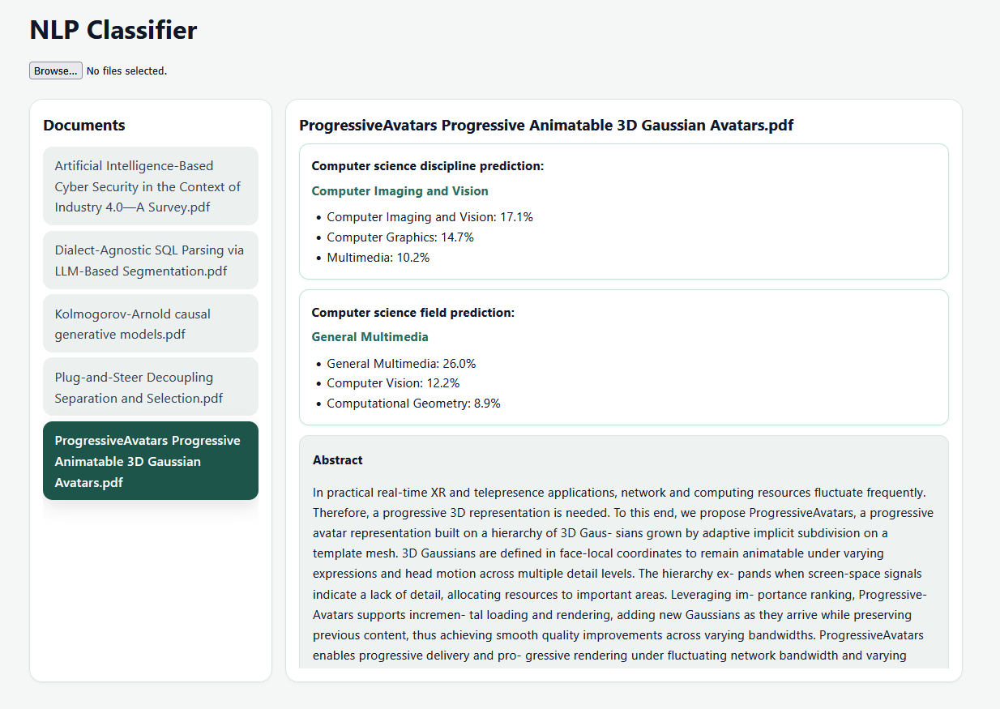

# CS Paper Classifier — NLP discipline & field classification

A web application that classifies computer science research papers by **discipline** and **field** from a PDF upload. Built end-to-end: data collection from the arXiv API, an iterative modeling pipeline (TF-IDF + Logistic Regression, tuned with Optuna, benchmarked against SciBERT), and a FastAPI + React app serving the final model.

> Developed as my BSc Computer Science final project (University of London).



## Highlights

- **78,000+ labeled abstracts** collected from the arXiv API (2021–2025), mapped to a two-level taxonomy (discipline → field) informed by the Computer Science Ontology (CSO)
- **Iterative development across 7 stages**: baseline → representations → classifier comparison → class balancing → data expansion → title augmentation → Optuna tuning, with a SciBERT benchmark at the end
- **Macro F1 improved from 0.55 → 0.63** (discipline) and **0.50 → 0.54** (field) for the deployed classical model — the largest single gain came from expanding and balancing the data (15.7k → 78k samples), not from model complexity
- **SciBERT scored only ~0.03 higher** (0.656 / 0.572), so the deployed model is the **tuned TF-IDF + Logistic Regression** — near-equal accuracy at a fraction of the inference cost
- **Taxonomy-based re-ranking**: when the predicted field's parent discipline disagrees with the predicted discipline and the scores are close, the prediction is re-ranked for logical consistency
- Rule-based **abstract extraction** from PDFs that handles varied paper layouts

## Results (Macro F1, held-out test set)

| Task | Baseline | Tuned (Optuna) | SciBERT |
|---|---|---|---|
| Discipline | 0.552 | 0.630 | 0.656 |
| Field | 0.502 | 0.541 | 0.572 |

Full per-stage metrics are in [`backend/data/results/`](backend/data/results) and aggregated with plots in [`15_evaluation.ipynb`](15_evaluation.ipynb).

## Architecture

```
PDF upload → FastAPI backend → text extraction (PyPDF) → abstract detection (rule-based)
          → TF-IDF vectorization → LogReg classifiers (discipline + field)
          → taxonomy consistency re-ranking → React frontend (top-3 predictions + probabilities)
```

## Notebook pipeline

| # | Notebook | Purpose |
|---|---|---|
| 01 | category_volume | Assess arXiv category volumes, select classes |
| 02 | scraper | Collect abstracts via the arXiv API; CSO-informed taxonomy |
| 03 | cleaning_eda | Cleaning, EDA, vocabulary analysis |
| 04 | baseline | TF-IDF + Logistic Regression baseline |
| 05 | representations | TF-IDF variants vs. Word2Vec |
| 06 | classifiers | LogReg vs. Linear SVM vs. Complement NB vs. Random Forest |
| 07 | capped_disciplines | Class-imbalance mitigation |
| 08–09 | data expansion | Expand dataset to 78k samples (2021–2025); retrain |
| 10–12 | titles | Title augmentation and weighting experiments |
| 13 | optuna_tuning | Hyperparameter optimization → final model |
| 14 | scibert | Transformer benchmark |
| 15 | evaluation | Cross-stage comparison, plots and final analysis |

Training datasets are not stored in the repo (size); notebooks 02–03 regenerate them from the arXiv API. The trained models (`.pkl`) **are** included, so the app runs without any training.

## Running locally

**Backend**
```bash
cd backend
pip install -r requirements.txt
uvicorn app:app --reload        # http://127.0.0.1:8000
```

**Frontend**
```bash
cd frontend
npm install
npm run dev                     # http://localhost:5173
```

## Repository structure

```
01–15_*.ipynb       # Modeling pipeline, numbered in order
backend/            # FastAPI app: extraction/, model/ (classifier + .pkl), data/results/
frontend/           # React (Vite) UI
docs/               # Screenshots
```

## Tech stack

Python · scikit-learn · Optuna · SciBERT (transformers) · pandas · FastAPI · PyPDF · React (Vite) · JavaScript

## Limitations & future work

- Residual class imbalance affects smaller disciplines; TF-IDF limits deeper semantic capture
- Planned: hierarchical field–discipline classification, SHAP-based explainability, corpus-level analysis with persistent storage

## License

MIT
